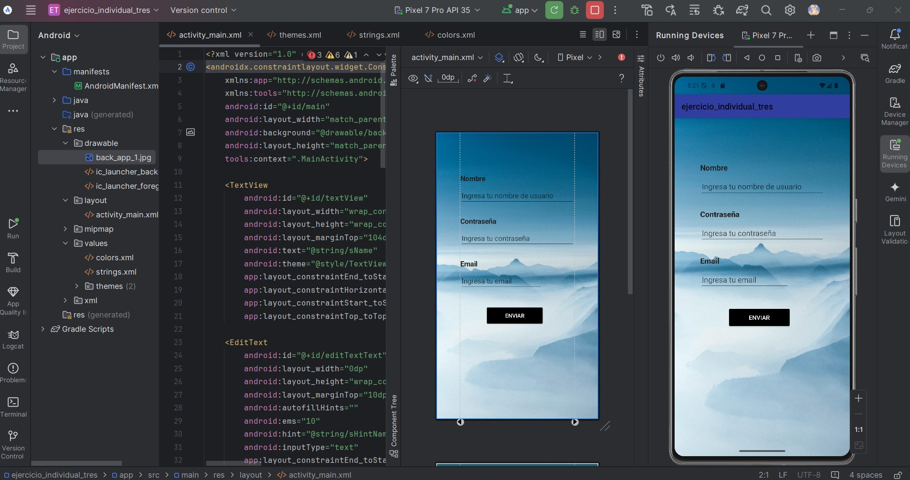

**_<h2 align="center">:vulcan_salute: Ejercicio Individual 3 - Ingreso Usuario :computer:</h2>_**

Proyecto que corresponde a la primera parte, realizado según los siguientes requerimientos:

El siguiente proyecto consta de dos partes; en esta instancia __(ejercicio individual 3)__ realizaras el diseño de tu aplicación, es decir, distribuirás los objetos en el layout utilizando correctamente __ConstraintLayout__ y todo lo que implique la creación de un diseño profesional.
La segunda parte del proyecto consistirá en agregarle algo de lógica a la vista.

1. Crea un nuevo proyecto que tenga como base en el _activity_main.xml_ un __ConstraintLayout__.

2. Utiliza los componentes que Android Studio pone a tu disposición. Lo importante es que la vista pida el ingreso de __Nombre, Contraseña y Correo (Email)__. Además, que muestre un __botón de acción__ _(Que por ahora solo será de carácter visual)_.
    - Los componentes deben respetar el __tipo de dato__ que se está pidiendo, por ejemplo, una contraseña no se puede visualizar directamente.

3. Se evaluará el uso correcto de __Values__, por ende, no deben existir colores ni textos que estén puestos a la fuerza en el layout. __(No Hardcoded)__.

4. El diseño es de _libre elección_, lo importante es que se respete la correcta organización de un proyecto. El uso de guías _(Guidelines)_ es opcional dentro del layout.

